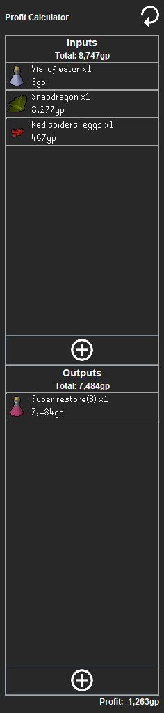

# Profit Calculator

The Profit Calculator plugin aims to assist in calculating profits from processing items.
It operates within a side panel, for which you can enter the inputs and outputs of your operation.
The plugin will use the grand exchange averages to compute the profit.

