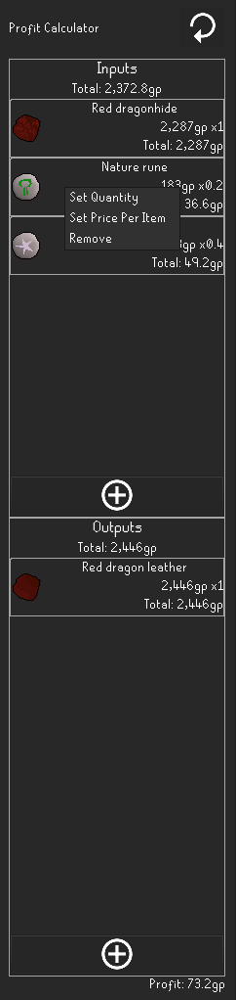

# Profit Calculator

The Profit Calculator plugin aims to assist in calculating profits from processing items.
It operates within a side panel, in which you can enter the inputs and outputs of your operation.
The plugin will use the grand exchange averages as default values,
but you can provide any value you like by right clicking an entry.

